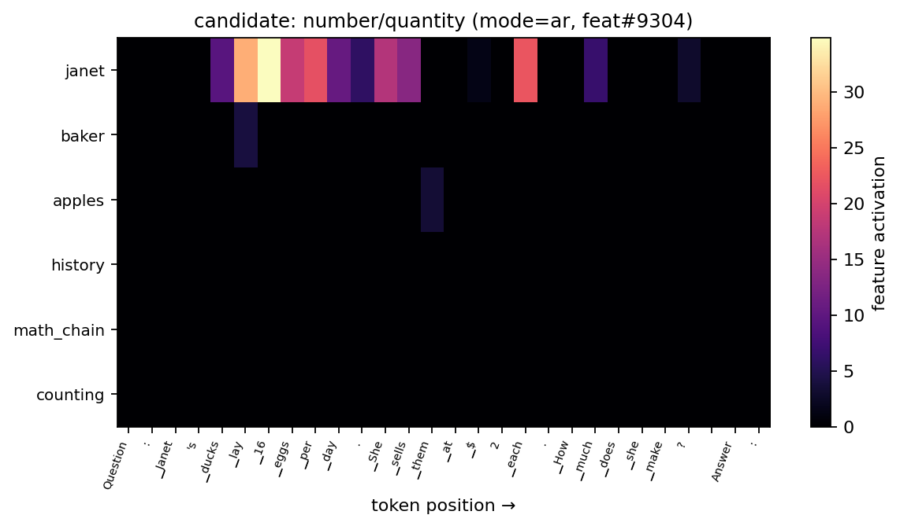
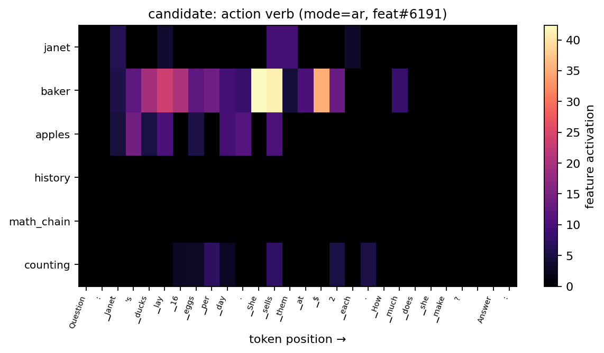
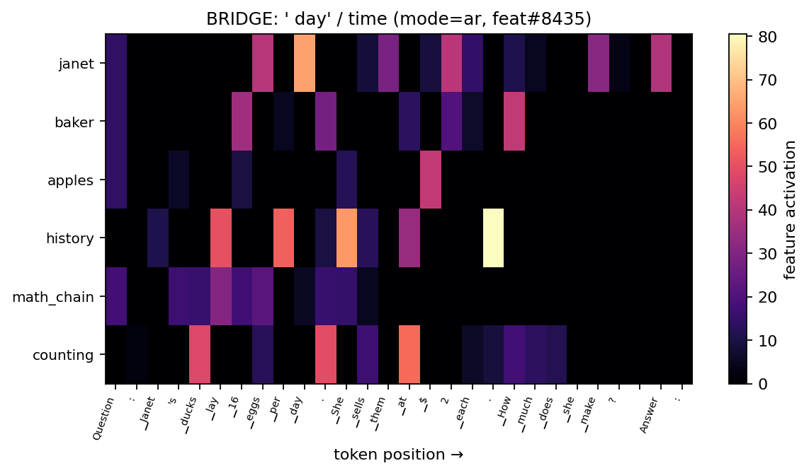
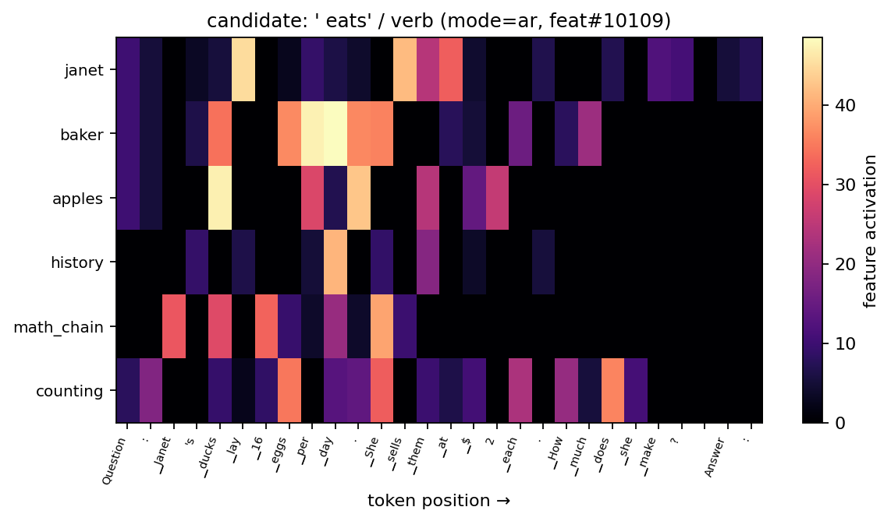
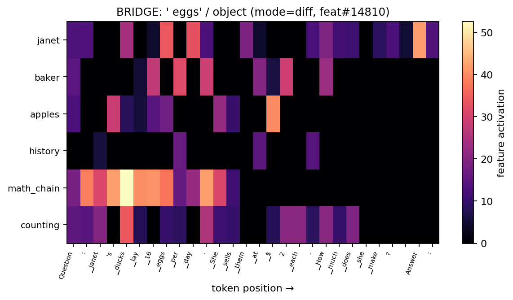
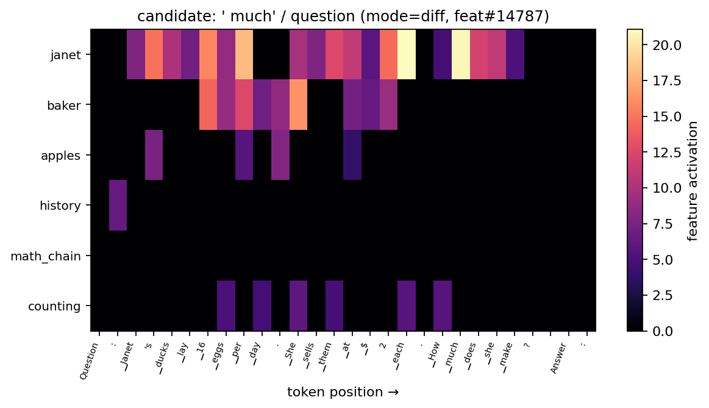
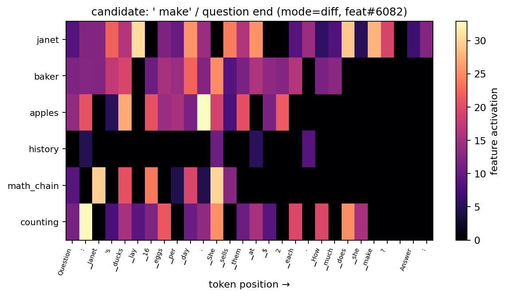
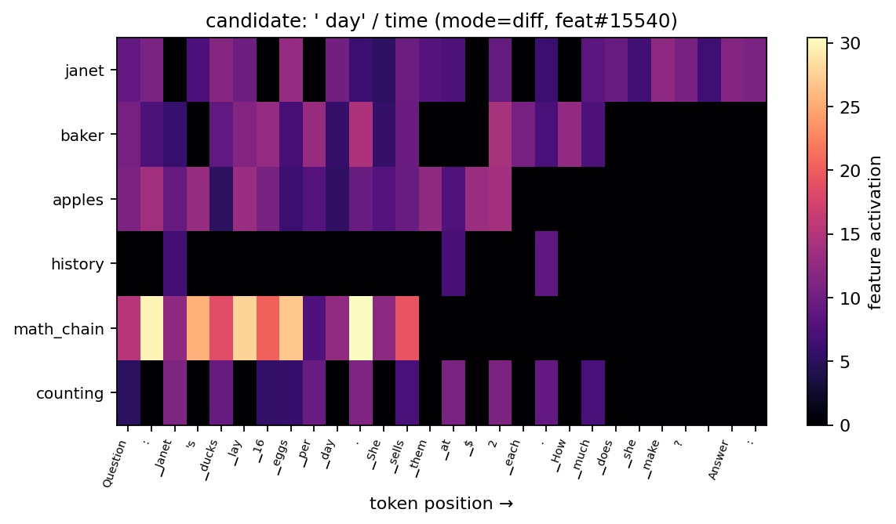

# P.4 feature firing demo (visual)

Per-feature heatmaps across 6 prompts. Brighter = stronger activation.
Bridge features were identified in P.2 as the high-cosine matched
pairs between AR and diff (the ~20 universal features the modes
share). Candidates are heads-only top firing features from P.3.

## AR-head features

## diff-head features

